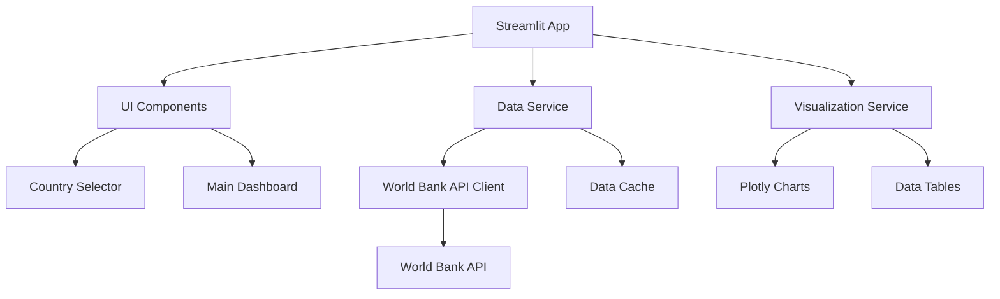

# Design Document

## Overview

The Gini Inequality Visualizer is a Streamlit-based web application that provides interactive visualization of income inequality trends using the Gini coefficient. The application fetches real-time data from the World Bank API and presents it through an intuitive interface with country selection, time-series visualization, and detailed tabular data.

The application follows a modular architecture with separate components for data fetching, processing, visualization, and user interface, ensuring maintainability and extensibility.

## Architecture

### High-Level Architecture



### Data Flow

1. **Application Initialization**: Load country list from World Bank API
2. **Country Selection**: User selects country from sidebar dropdown
3. **Data Fetching**: Retrieve Gini data for selected country with caching
4. **Data Processing**: Clean and format data using pandas
5. **Visualization**: Generate line plot and data table
6. **Display**: Render components in Streamlit interface

## Components and Interfaces

### 1. Data Service Module (`data_service.py`)

**Purpose**: Handle all data fetching and processing operations

**Key Classes/Functions**:
- `WorldBankClient`: API client for World Bank data
- `get_countries()`: Fetch available countries
- `get_gini_data(country_code, start_year, end_year)`: Fetch Gini data
- `DataCache`: Simple caching mechanism to reduce API calls

**Interface**:
```python
class WorldBankClient:
    def __init__(self):
        self.base_url = "https://api.worldbank.org/v2"
        self.cache = {}
    
    def get_countries(self) -> List[Dict[str, str]]:
        """Fetch list of countries with codes and names"""
        pass
    
    def get_gini_data(self, country_code: str, start_year: int = 1990, end_year: int = 2023) -> pd.DataFrame:
        """Fetch Gini coefficient data for specified country and time range"""
        pass
```

### 2. Visualization Service Module (`visualization.py`)

**Purpose**: Create charts and tables using plotly and pandas

**Key Functions**:
- `create_gini_line_plot(data, country_name)`: Generate interactive line chart
- `create_gini_table(data)`: Format data table for display
- `format_gini_data(raw_data)`: Clean and structure data

**Interface**:
```python
def create_gini_line_plot(data: pd.DataFrame, country_name: str) -> plotly.graph_objects.Figure:
    """Create interactive line plot of Gini index over time"""
    pass

def create_gini_table(data: pd.DataFrame) -> pd.DataFrame:
    """Format Gini data for tabular display"""
    pass
```

### 3. UI Components Module (`ui_components.py`)

**Purpose**: Streamlit UI components and layout management

**Key Functions**:
- `render_sidebar(countries)`: Create country selection sidebar
- `render_main_dashboard(data, country_name)`: Display charts and tables
- `show_loading_state()`: Display loading indicators
- `show_error_message(error)`: Handle error display

### 4. Main Application (`app.py`)

**Purpose**: Orchestrate the application flow and Streamlit configuration

**Key Responsibilities**:
- Initialize Streamlit page configuration
- Coordinate between data service, visualization, and UI components
- Handle application state management
- Error handling and user feedback

## Data Models

### Country Model
```python
@dataclass
class Country:
    code: str          # ISO country code (e.g., "USA")
    name: str          # Full country name (e.g., "United States")
    region: str        # World Bank region classification
```

### Gini Data Model
```python
@dataclass
class GiniDataPoint:
    year: int          # Year of measurement
    value: float       # Gini coefficient (0-100 scale)
    country_code: str  # ISO country code
    
class GiniTimeSeries:
    country: Country
    data_points: List[GiniDataPoint]
    
    def to_dataframe(self) -> pd.DataFrame:
        """Convert to pandas DataFrame for visualization"""
        pass
```

## Error Handling

### API Error Handling
- **Connection Errors**: Display user-friendly message and retry option
- **Rate Limiting**: Implement exponential backoff and inform user
- **Data Not Available**: Show appropriate message when country has no Gini data
- **Invalid Responses**: Log errors and provide fallback behavior

### Data Validation
- **Missing Values**: Handle gaps in time series data appropriately
- **Invalid Ranges**: Validate Gini values are within expected range (0-100)
- **Date Validation**: Ensure year values are reasonable

### User Experience
- **Loading States**: Show progress indicators during data fetching
- **Error Messages**: Clear, actionable error messages
- **Graceful Degradation**: Partial functionality when some features fail

## Testing Strategy

### Unit Tests
- **Data Service Tests**: Mock API responses and test data processing
- **Visualization Tests**: Test chart generation with sample data
- **Utility Function Tests**: Test data formatting and validation functions

### Integration Tests
- **API Integration**: Test actual World Bank API connectivity (with rate limiting)
- **End-to-End Flow**: Test complete user workflow from country selection to visualization

### Manual Testing
- **Cross-browser Compatibility**: Test Streamlit app in different browsers
- **Responsive Design**: Verify layout works on different screen sizes
- **Performance Testing**: Test with multiple countries and large datasets

## Technical Specifications

### Dependencies
- **Core**: `streamlit`, `pandas`, `requests`
- **Visualization**: `plotly`
- **Development**: `pytest`, `black`, `flake8`

### Configuration
- **API Settings**: Base URL, timeout settings, retry configuration
- **Cache Settings**: TTL for country list and Gini data
- **UI Settings**: Default country, chart styling, table formatting

### Performance Considerations
- **Caching Strategy**: Cache country list and recently accessed Gini data
- **Lazy Loading**: Load data only when country is selected
- **API Optimization**: Batch requests where possible, respect rate limits

### Deployment
- **Local Development**: `streamlit run app.py`
- **Requirements**: All dependencies listed in `requirements.txt`
- **Environment Variables**: Optional API keys or configuration overrides